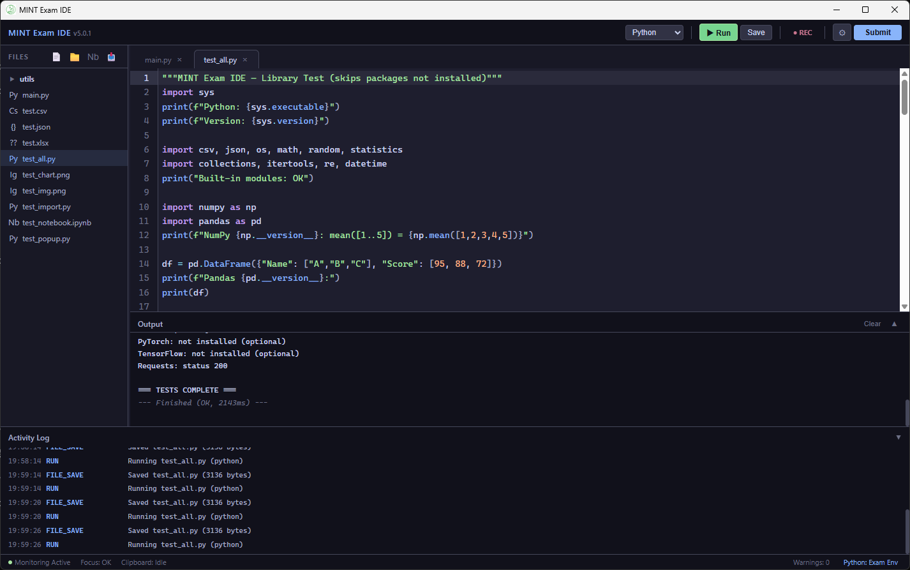
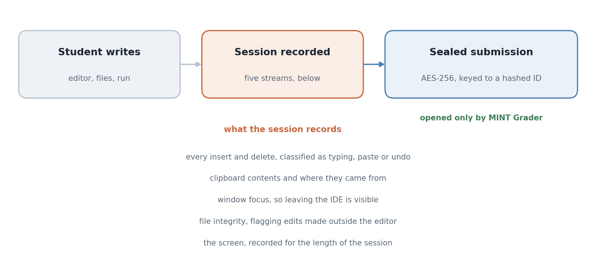

<div align="center">

# MINT Exam IDE

Yuhyeon Lee · 2026

[](https://github.com/blueion0612/Mint_IDE_Student/actions/workflows/build.yml)
[](LICENSE)
[](#requirements)
[](#limitations)
[](https://github.com/blueion0612/Mint_IDE_Student/releases)

[**Releases**](https://github.com/blueion0612/Mint_IDE_Student/releases) · [**Grader**](https://github.com/blueion0612/Mint_IDE_Teacher) · [**Related**](#related)



</div>

*The IDE during a session on Windows. A library check runs in the exam environment,
and every save and run lands in the activity log along the bottom.*

**MINT Exam IDE** is the student side of a programming exam. It is an editor that
records how the code was written, not only what was written, and seals the result
so that the file a student hands in cannot be edited afterwards. The invigilator
opens it with [MINT Grader](https://github.com/blueion0612/Mint_IDE_Teacher).

The editor chrome is English; the setup wizard, the dialogs and the alerts are
Korean, because that is who sits the exams it was built for.

## Features

### Editing

Syntax highlighting for Python, JavaScript, TypeScript, Java, C and
C++, and Jupyter notebooks open as cells, each keeping its own output. A file tree
with drag and drop, folders, renaming and import. Code runs from the editor with
its output in a panel beside it, and Python can be pointed at the system
interpreter or a chosen virtual environment.

### Recording

Five streams run for the length of the session:

| Stream | What it captures |
|---|---|
| Edit history | every insert and delete, classified as typing, paste or undo |
| Clipboard | what was pasted, and which application it came from |
| Window focus | when the IDE stopped being the foreground window |
| File integrity | files changed outside the editor, flagged as tampering |
| Screen | a recording covering the session |

### Submission

The work is packed into an AES-256 encrypted archive whose key is
derived from a hashed student identifier, so a submission cannot be opened, altered
or re-sealed after the fact without the grader.

<picture>
  <source media="(prefers-color-scheme: dark)" srcset="docs/figures/hero_flow-dark.png">
  
</picture>

*The exam lifecycle. The recorder, in gold, runs for the length of the session and
feeds the sealed submission, in green, which only MINT Grader opens.*

## Quick start

Installers for each release are on the
[releases page](https://github.com/blueion0612/Mint_IDE_Student/releases). To set up
a machine from scratch instead, run the project's own installer script.

**Windows**, from an administrator PowerShell:

```powershell
Set-ExecutionPolicy Bypass -Scope Process -Force
irm https://raw.githubusercontent.com/blueion0612/Mint_IDE_Student/main/install-windows.ps1 | iex
```

It installs a portable Python 3.12.13 build, Node, a JDK, FFmpeg, WebView2 and the
IDE in one pass. Nothing collides with an existing Python: the portable build is
unpacked to `C:\ProgramData\MINT_Python\Python312` and used only by the IDE. A
Korean-language Windows account is handled automatically, by enabling long paths and
falling back to an ASCII path for the virtual environment.

**macOS**, which builds from source because the project has no Apple Developer
certificate:

```bash
curl -sL https://raw.githubusercontent.com/blueion0612/Mint_IDE_Student/main/install-mac.sh | bash
```

It installs the Xcode command line tools, Homebrew, Python 3.12, Rust, Node, a JDK
and FFmpeg, clones and builds, then copies the app to `/Applications`. Expect five to
ten minutes and around 500 MB of downloads.

## Usage

**First run on macOS asks for two permissions, and both are required.** Screen
Recording starts the session recording within about fifteen seconds of being
granted. Automation, under System Events, needs the IDE restarted before it takes
effect. If the dialogs were dismissed, enable *MINT Exam IDE* under System Settings,
Privacy and Security, in both Screen Recording and Automation, then restart it.

A submission produced here is opened with
[MINT Grader](https://github.com/blueion0612/Mint_IDE_Teacher), which decrypts a
whole batch and presents the edit history beside the code.

## Repository layout

```
src/                  the editor front end, TypeScript
src-tauri/            the Rust side: monitoring, recording, packaging
  src/monitor/        clipboard, focus and integrity watchers
  src/recorder.rs     screen recording
install-windows.ps1   one-pass Windows setup
install-mac.sh        macOS setup, builds from source
install-linux.sh      Linux setup
docs/figures/         the screenshot, the lifecycle figure and the script that draws it, figstyle.py
```

## Requirements

To run an installer, nothing: it brings its own toolchain. To build from source,
Node.js 18 or newer, Rust 1.77.2 or newer, which is the minimum Tauri 2 supports,
and FFmpeg, plus whichever language runtimes the exam needs available on the
machine.

```bash
npm install
npx tauri build
```

## Limitations

- **Windows and macOS.** There is a Linux script, but releases are built for Windows
  and the macOS path builds from source rather than shipping a signed app.
- **macOS is unsigned**, so it builds locally and the first run needs permissions
  granted by hand.
- **The recording is only as good as the permissions granted.** A student who denies
  Screen Recording produces a submission with no screen stream, which the grader
  sees as absent rather than as clean.
- **The wizard, the dialogs and the alerts are Korean only**, though the editor
  chrome itself is English.
- Integrity checking detects edits made outside the editor. It is not a sandbox and
  does not prevent them.

## Related

- [MINT Grader](https://github.com/blueion0612/Mint_IDE_Teacher): the invigilator's
  half. It verifies and decrypts a whole batch of the submissions this editor seals,
  and lays the edit history beside the code.

## License

MIT. See [LICENSE](LICENSE).
